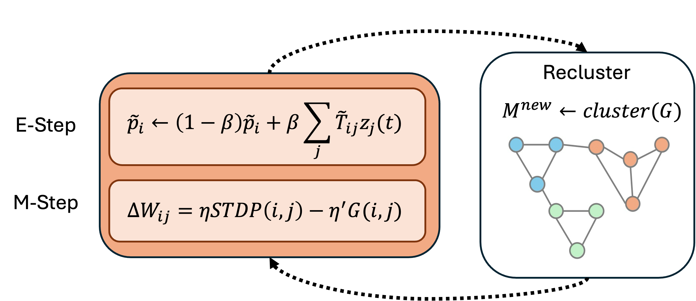

# Map-STDP: Does it form cortices?

Author: Vikram Ramavarapu

**Abstract.** STDP is a local learning rule that may not capture the global modular structure of a neural network. This document derives a new Map-STDP rule from the map equation, an information-theoretic objective function for community detection.

> **Changes from the original `derivation/mapstdp.tex`.** This document is a corrected rewrite of that file, which is kept unchanged for history. The corrections are:
>
> 1. **One direction convention.** $W_{ij}$ is the synapse from presynaptic $j$ to postsynaptic $i$, as in Buesing et al. The random walk follows spikes forward, $j \to i$. The original row-normalized $T$ over presynaptic partners but then wrote $\tilde p = \tilde T \tilde p$, and those two choices are inconsistent.
> 2. **Stimulus as teleportation.** The stationary flow now includes an external-input term, $\pi = (1-\alpha)T\pi + \alpha v(\mathbf o)$. This makes the chain irreducible and gives the stimulus an explicit place in the equations.
> 3. **Flow vs. firing.** The original identified the firing marginal $p(z_j{=}1\mid\mathbf o)$ with the walk's stationary distribution without justification. That identification is now an explicit mean-field assumption (§3.2).
> 4. **Sign error.** The expansion of $L(M)$ gave two of its three terms the wrong sign. The correct gradient factor is $\log\frac{q_\curvearrowright(p_m+q_m)}{q_m^2} \ge 0$, not $\log\frac{q_\curvearrowright}{p_m+q_m} \le 0$. Absorbing the log into the learning rate is therefore legitimate, without the "negative learning rate" argument. This was checked numerically against finite differences.
> 5. **Gating indexed by the presynaptic neuron.** The simplified rule becomes $G_{sim}(i,j) = \mathbb I[i \notin m(j)] - \bar e_j$. The locality argument changes from dendritic sums to presynaptic (axonal) sums.
> 6. **Convergence.** The original proof only showed that $\tilde p$ is a fixed point. With teleportation the update is a contraction, so it has a unique fixed point and converges to it. The singular $(I-T)^{-1}$ becomes the invertible $(I-(1-\alpha)T)^{-1}$.
> 7. **Lateral inhibition.** This variant is restated with a soft indicator $\chi_{ij}$. Open problems with its anti-Hebbian update are flagged (§4).

---

## 1. Introduction

### 1.1 Problem

Spike-timing dependent plasticity (STDP) [Shouval et al. 2010] is a biologically plausible learning rule that is widely used in spiking neural networks. When a presynaptic neuron fires shortly before a postsynaptic neuron, the synapse between them is strengthened. When the presynaptic neuron fires shortly after, the synapse is weakened.

STDP is fully local, however, and may not capture the global structure of the network. Ideally the learning rule should guide the network to form *cortices*: densely connected communities of neurons that are sparsely connected to other communities.

### 1.2 Why cortices?

Cortices enable expressive spatial population codes, so that each cortex can be mapped to a concept.

In ImageNet classification, for example, we want the network to learn a modular structure where each community corresponds to a class. The network could then use that modular structure to learn more compact representations of each class.

In the Gymnasium car-racing environment, we would want the network to form five cortices, one each for: do nothing, accelerate, brake, turn left, and turn right.

### 1.3 Random walks and the map equation

Neural dynamics are highly stochastic and can be read as a form of random walk [Buesing et al. 2011]. Random walks are also the core of the map equation, the objective that the Infomap community-detection algorithm minimizes [Rosvall & Bergstrom 2008]. The map equation measures a network's modular structure by the amount of information needed to describe a random walk's flow of activity through the network.

This document derives a Map-STDP rule that incorporates the map equation. It is a local learning rule that can still capture the network's global modular structure. It stays biologically realistic because it relies on information-theoretic objectives, stochastic neural dynamics, and local synaptic updates.

## 2. Infomap and entropy

### 2.1 Infomap

Infomap finds communities by minimizing the map equation:

$$L(M) = q_{\curvearrowright} H(\mathcal{Q}) + \sum_{m \in M} p_{\circlearrowright}^{m} H(\mathcal{P}^{m})$$

where $M$ is a partition of the network into communities. The first term is the entropy of movement *between* communities. The second term is the entropy of movement *within* each community, where exiting the community also counts as a movement.

### 2.2 Connecting the map equation to neural computation

Map-STDP is meant to be combined with a standard STDP rule that maximizes mutual information between stimulus and neural response, a well-established consequence of Hebbian learning under information-theoretic objectives [Dayan & Abbott 2001]. The STDP term handles the expressivity of single neurons. The map-equation term acts as a structural constraint at the population level.

The deeper grounding comes from variational free energy [Friston 2010]. The SNN's MCMC dynamics [Buesing et al. 2011] produce a stationary distribution $p(\mathbf z \mid \mathbf o)$ over neural activity patterns given sensory input $\mathbf o$. This is the recognition density that minimizes variational free energy, and it is the network's implicit model of the world. The map equation operates on flow quantities that come from the same sampling process (§3.2). Map-STDP therefore does not introduce a separate objective. It imposes mesoscale community structure on the distribution the network is already converging to.

## 3. Deriving Map-STDP

We start from a rule of the form

$$\Delta W_{ij} = \eta \cdot \mathrm{STDP}(i, j) - \eta' \cdot G(i, j) \tag{1}$$

where $\mathrm{STDP}(i,j)$ is a standard STDP rule that maximizes response entropy, $G(i,j)$ is a modular gating function, and $\eta, \eta' > 0$ are separate learning rates. The two terms are additive rather than multiplicative, so each objective acts independently. STDP drives synapses toward maximal response entropy, and the gating term performs gradient descent on the map equation. The goal of this section is to derive $G(i,j)$.

### 3.1 Conventions and the flow model

We follow Buesing et al.'s membrane equation for an SNN that performs MCMC sampling:

$$u_i = b_i + \sum_j W_{ij} z_j(t)$$

where $u_i$ is the membrane potential of neuron $i$, $b_i$ is its bias, and $z_j(t) \in \{0,1\}$ is the spike variable of neuron $j$. **$W_{ij} \ge 0$ is therefore the synapse from presynaptic $j$ to postsynaptic $i$**, and activity flows $j \to i$.

The random walk follows the spikes. From neuron $j$, the walker moves to a postsynaptic target $i$ with probability proportional to the synaptic weight:

$$T_{ij} := P(j \to i) = \frac{W_{ij}}{d_j}, \qquad d_j = \sum_k W_{kj}$$

Here $d_j$ is the total outgoing (axonal) weight of $j$. Each column of $T$ sums to 1.

**Stimulus as teleportation.** Recurrent activity does not sustain itself. A fraction $\alpha \in (0,1]$ of each step's activity is injected by the stimulus. Let $v(\mathbf o)$ be the normalized external drive: $v_i \ge 0$, $\sum_i v_i = 1$, and $v_i$ is proportional to the sensory input current into neuron $i$. The flow is then

$$\pi^{(t+1)} = (1-\alpha)\,T\pi^{(t)} + \alpha\, v(\mathbf o)$$

and the stationary flow $\pi$ satisfies

$$\pi = (1-\alpha)\,T\pi + \alpha\, v(\mathbf o), \qquad \sum_i \pi_i = 1 \tag{2}$$

This is personalized PageRank with the stimulus as the personalization vector. Theorem 1 shows that it has a unique solution for any $\alpha > 0$ and that power iteration converges to it. Teleportation also removes the need for a separate irreducibility argument: the trivial fixed points ($\pi = 0$, or $T = I$ with isolated nodes) are excluded because the stimulus keeps re-injecting flow.

### 3.2 Flow and firing (mean-field assumption)

To tie $\pi$ to spikes, we assume a linear-rate, mean-field regime. The normalized firing rates $r_i = \langle z_i \rangle / \sum_k \langle z_k \rangle$ satisfy

$$r_i = (1-\alpha)\sum_j \frac{W_{ij}}{d_j}\, r_j + \alpha\, v_i$$

This holds when each neuron's rate is approximately linear in its input, recurrent input is presynaptically normalized (each neuron distributes a fixed total efficacy across its synapses), and a fraction $\alpha$ of the total drive is external. Under this assumption $r = \pi$ by uniqueness (Theorem 1). This is a modelling assumption, not a derived fact, and whether it holds in the simulated regime should be measured.

**Online E-step.** Each neuron can estimate its flow from local input:

$$\hat\pi_i \leftarrow (1-\beta)\,\hat\pi_i + \beta\left[(1-\alpha)\sum_j \frac{W_{ij}}{d_j}\,\hat z_j(t) + \alpha\, v_i\right] \tag{3}$$

where $\hat z(t) = z(t)/\sum_k z_k(t)$ is the normalized spike vector, taken as zero when nothing fires. The bracketed term is neuron $i$'s presynaptically normalized recurrent drive plus its external drive, so it is available at the neuron. Its expectation is $[(1-\alpha)Tr + \alpha v]_i = \pi_i$ under the assumption above. As an exponential moving average, (3) therefore tracks $\pi$ with a steady-state variance of $O(\beta)$ (Theorem 1, online remark). Under the same assumption, a plain moving average of normalized spike counts is an equivalent estimator.

### 3.3 The map equation in terms of flow

For a partition $M$, write $m(j)$ for the community of neuron $j$ and define

$$p_m := \sum_{j \in m} \pi_j, \qquad q_m := \sum_{j \in m} \pi_j \sum_{i \notin m} T_{ij} = \sum_{j \in m} \pi_j\, \bar e_j$$

$$p_{\circlearrowright}^m = p_m + q_m, \qquad q_\curvearrowright = \sum_{m} q_m$$

where

$$e_j := \sum_{i \notin m(j)} W_{ij}, \qquad \bar e_j := \frac{e_j}{d_j}$$

$\bar e_j$ is the fraction of $j$'s outgoing weight that leaves its community. $p_m$ is the visit rate of community $m$, and $q_m$ is its exit rate over recurrent links. For simplicity, teleportation steps are not counted as exits.

The two entropies are

$$H(\mathcal Q) = -\sum_m \frac{q_m}{q_\curvearrowright}\log\frac{q_m}{q_\curvearrowright}$$

$$H(\mathcal P^m) = -\frac{q_m}{p_m+q_m}\log\frac{q_m}{p_m+q_m} - \sum_{j \in m}\frac{\pi_j}{p_m+q_m}\log\frac{\pi_j}{p_m+q_m}$$

Substituting into $L(M)$ gives three terms, **all with a negative sign**. The original derivation had a `+` on the last two:

$$L(M) = \underbrace{-\sum_m q_m \log\frac{q_m}{q_\curvearrowright}}_{A}\; \underbrace{-\sum_m q_m\log\frac{q_m}{p_m+q_m}}_{B}\; \underbrace{-\sum_m\sum_{j\in m}\pi_j\log\frac{\pi_j}{p_m+q_m}}_{C}$$

Equivalently, this is the standard form

$$L(M) = q_\curvearrowright\log q_\curvearrowright - 2\sum_m q_m\log q_m - \sum_j \pi_j\log\pi_j + \sum_m (p_m+q_m)\log(p_m+q_m)$$

### 3.4 The gradient (EM approximation)

$\pi$ depends on $W$ through (2). Differentiating (2) gives

$$\frac{\partial \pi}{\partial W_{ij}} = (1-\alpha)\,\big(I - (1-\alpha)T\big)^{-1}\frac{\partial T}{\partial W_{ij}}\,\pi$$

The matrix is invertible for $\alpha > 0$, but computing it requires a global inversion. We avoid it by holding $\pi$ fixed during the synaptic update, which is an EM interpretation. The E-step re-estimates $\pi$ via (3). The M-step updates $W$ with $\pi$ fixed, so $\partial p_m/\partial W_{ij} = 0$.

With $\pi$ fixed, $W_{ij}$ enters only column $j$ of $T$, and so only $q_{m(j)}$. Theorem 2 gives

$$G(i,j) = \frac{\partial L}{\partial W_{ij}} = \frac{\pi_j}{d_j}\Big(\mathbb I[i \notin m(j)] - \bar e_j\Big)\,\log\frac{q_\curvearrowright\,(p_{m(j)} + q_{m(j)})}{q_{m(j)}^2} \tag{4}$$

### 3.5 Simplification

In (4):

- $\pi_j$ and $d_j$ are positive.
- The log factor is **nonnegative**, because $q_\curvearrowright \ge q_m$ and $p_m + q_m \ge q_m$ make its argument at least 1. It diverges only when $q_m \to 0$, which is a community with no exits.

All three factors can therefore be absorbed into a positive, per-neuron effective learning rate without changing the sign of the update. This gives the simplified gating function

$$G_{sim}(i, j) = \mathbb I[i \notin m(j)] - \bar e_j \tag{5}$$

With $\Delta W_{ij} = \ldots - \eta' G_{sim}(i,j)$:

- If the postsynaptic $i$ is in a **different** community from $j$, then $G_{sim} = 1 - \bar e_j > 0$ and $W_{ij}$ decreases. Cross-community connections are discouraged.
- If $i$ is in the **same** community, then $G_{sim} = -\bar e_j \le 0$ and $W_{ij}$ increases. Intra-community connections are reinforced.

In both cases the size of the update scales with $\bar e_j$, the current exit fraction of the presynaptic neuron. Neurons already contained within their community ($\bar e_j \approx 0$) get small updates, and leaky neurons ($\bar e_j \approx 1$) get large corrections. The rule is self-regulating: it applies the most pressure where community structure is most violated.

Dropping $\pi_j / d_j$ also removes the full gradient's weighting by presynaptic flow. If high-flow neurons should dominate structural change, $\pi_j$ can be kept as a factor.

### 3.6 Locality

Because $W_{ij} = 0$ for non-neighbours, the sums in (5) run only over the out-neighbours $N^{out}(j)$ of the presynaptic neuron:

$$d_j = \sum_{i \in N^{out}(j)} W_{ij}, \qquad e_j = \sum_{i \in N^{out}(j)} \mathbb I[i \notin m(j)]\, W_{ij}$$

The update at synapse $(i,j)$ therefore needs:

- presynaptic quantities $\bar e_j$ (and $\pi_j$, $d_j$ if they are kept), which are sums over $j$'s own axonal synapses;
- one bit of membership information about the partner, $\mathbb I[i \notin m(j)]$.

The axonal sums are plausibly tracked by the presynaptic neuron, for example as a shared presynaptic resource pool. This is a weaker locality story than dendritic summation at the postsynaptic neuron. The membership bit is the non-local ingredient, and §4 addresses it.

The alternative convention, where the walker moves from $i$ to its presynaptic inputs with dendritic normalization, would put the sums at the postsynaptic neuron. The cost is losing the link between flow and firing in §3.2. This trade-off is recorded as an open question in `SPEC.md`.

## 4. Biological plausibility

The STDP term maximizes response entropy, and the map-equation term encourages modular structure. Two parts of Map-STDP are less biologically plausible:

- **Community assignments.** The rule needs the community of each neuron, which is not explicitly represented in the brain.
- **EM phase separation.** The E-step updates $\pi$ while the M-step updates $W$ with $\pi$ fixed. This separation of timescales may need coordination that neural circuits do not have. It can be relaxed if $\eta' \ll \beta$, so that $W$ changes slowly relative to the flow estimate.

The main problem is the global assignment of neurons to communities. In real cortex, lateral inhibition is a local mechanism from which distinct communities can emerge without any explicit global assignment.

### 4.1 Lateral-inhibition variant

Introduce inhibitory weights $I_{ij} \ge 0$, the strength of inhibition from $j$ onto $i$. Replace the hard indicator $\mathbb I[i \notin m(j)]$ with a soft competition score $\chi_{ij} \in [0,1)$ that increases with inhibition, for example

$$\chi_{ij} = \frac{I_{ij}}{I_{ij} + \kappa}$$

with half-saturation constant $\kappa$. $\chi_{ij}$ is high when $i$ and $j$ strongly compete, which suggests they belong to functionally distinct communities, and near zero when they cooperate. Redefine the exit fraction as $\bar e^{\chi}_j = \frac{1}{d_j}\sum_{i'} \chi_{i'j} W_{i'j}$. The laterally inhibited gating function is then

$$G_{\chi}(i,j) = \chi_{ij} - \bar e^{\chi}_j \tag{6}$$

When $\chi$ is binary, (6) reduces exactly to (5). Community membership is no longer an explicit global label: it is encoded implicitly in inhibitory drive.

> **Changed from the original.** The original used $\varphi_{ij} = I_{ij}\tilde p_j / \sum_k I_{ik}\tilde p_k$. That score is normalized to sum to 1 per neuron, so it is not on the scale of the indicator it replaces, and (6) would not reduce to (5).

**Inhibitory plasticity (open).** The original proposed the anti-Hebbian rule $\Delta I_{ij} = \eta_{inh}\,\pi_i\pi_j$. This rule has two problems.

1. It only ever increases $I$, so it needs a bound or decay.
2. It strengthens inhibition between **co-active** neurons, which marks them as competitors in different communities. Hebbian STDP pushes the same neurons to cooperate. The two pressures conflict, so the rule as written is likely to fragment communities rather than sharpen them.

In addition, pairing each excitatory $W_{ij}$ with a direct inhibitory $I_{ij}$ ignores Dale's law. Realistically, inhibition would go through interneuron populations. These problems are tracked in `SPEC.md`.

### 4.2 What Map-STDP adds over lateral inhibition alone

Lateral inhibition by itself, as in Kohonen self-organizing maps, creates community structure through competition. However, it optimizes an implicit objective: the partition that emerges is whatever the winner-take-all dynamics produce, with no guarantee of quality. Map-STDP adds two things that lateral inhibition cannot provide.

- **An explicit information-theoretic objective.** The map equation gives a measurable criterion for partition quality: the description length of a random walk through the network. That makes community structure interpretable and quantifiable instead of an emergent side effect.
- **Self-regulating update magnitude.** $\bar e_j$ (or $\bar e_j^\chi$) acts as adaptive gain control. Lateral inhibition alone only suppresses competitors. It carries no signal about how far the current partition is from the optimum.

## 5. Training

*The network of updates during training. In the E-step, the network dynamics run and $\pi$ is updated via (3). In the M-step, $W$ is updated with Map-STDP while $\pi$ is held fixed. The community assignments $M$ are either kept static or periodically re-detected with a community-detection algorithm.*

Training caches the following state:

- $M$: the community of each neuron, as an integer vector.
- $\pi$: the flow estimate, as a float vector.
- $N^{out}(j)$: the out-neighbours of each neuron, since the gating sums run over axonal synapses.
- $W$: the weights, with $W_{ij}$ = pre $j$ → post $i$, plus the per-neuron sums $d_j$ and $e_j$.

Open questions:

- **Should $M$ be static or periodically updated?** A static $M$ only reinforces the initial community structure, which may not be optimal. Periodically re-detecting it with Infomap lets the rule adapt as the network changes, at the cost of running community detection repeatedly.
- **How does the SNN change its topology, not just its weights?**
  - Threshold pruning: set $W_{ij} = 0$ when $W_{ij} < \epsilon$. This adds a hyperparameter and can destabilize training.
  - Top-$k$: keep each neuron's $k$ strongest connections. This preserves a minimum connectivity but can be unstable if $k$ is badly chosen.
- **How should the SNN and $M$ be initialized?**
  - An Erdős–Rényi graph with uniformly random communities is neutral but slow to converge, because both weights and communities must be learned from scratch.
  - A stochastic block model gives a head start but biases the result toward the initial partition.

Map-STDP uses the map equation as its objective, but it does not require Infomap communities: the rule accepts any partition $M$. For a fixed set of outcomes, such as classification or discrete control, methods that yield a fixed number of communities fit: Infomap with a constrained module count, or an SBM. For more flexible representations, Louvain or Leiden can produce a variable number of communities.

The model may also benefit from a **central workspace community** that broadcasts to all other communities. It would receive the receptive field that encodes the stimulus, so that $v(\mathbf o)$ is concentrated on it, and it would link to the output modules. This matches Global Neuronal Workspace Theory [Baars 2005], in which a central workspace integrates information from specialized modules and broadcasts it back.

---

## Appendix: Proofs

**Theorem 1 (existence, uniqueness, convergence).** Let $T$ be column-stochastic and $\alpha \in (0,1]$. Then (2) has a unique solution $\pi$ in the probability simplex, and power iteration $\pi^{(k+1)} = F(\pi^{(k)})$ with $F(x) := (1-\alpha)Tx + \alpha v$ converges to it geometrically from any starting distribution.

*Proof.* $F$ maps the simplex to itself: its entries are nonnegative and $\mathbf 1^\top F(x) = (1-\alpha)\mathbf 1^\top x + \alpha = 1$. A nonnegative column-stochastic matrix has $\|T\|_1 = 1$, so for any $x, y$ in the simplex

$$\|F(x) - F(y)\|_1 = (1-\alpha)\|T(x-y)\|_1 \le (1-\alpha)\|x - y\|_1$$

$F$ is therefore a contraction on a complete metric space. By the Banach fixed-point theorem it has a unique fixed point, and $\|\pi^{(k)} - \pi\|_1 \le (1-\alpha)^k\|\pi^{(0)} - \pi\|_1$. $\square$

*Online remark.* The bracketed target in (3) is an unbiased sample of $F(r)$, and $F(r) = \pi$ under the mean-field assumption of §3.2. Equation (3) is then an exponential moving average of i.i.d.-like samples with mean $\pi$. If the spike process mixes, standard stochastic-approximation arguments give $\mathbb E[\hat\pi] \to \pi$ with steady-state variance $O(\beta)$. A decaying $\beta_t$ with $\sum\beta_t = \infty$ and $\sum\beta_t^2 < \infty$ gives almost-sure convergence. When the mean-field assumption fails, (3) still converges, but to $F(r)$ rather than to the walk's $\pi$.

**Theorem 2 (gradient).** With $\pi$ held fixed, $\partial L / \partial W_{ij}$ is given by (4).

*Proof.* With $\pi$ fixed, the $p_m$ and the $\pi_j\log\pi_j$ terms are constants, and $L$ depends on $W$ only through $q = (q_m)_m$, with $q_\curvearrowright = \sum_m q_m$. Differentiate the three terms of §3.3 with respect to one $q_m$. In $A$, $q_\curvearrowright$ depends on $q_m$:

$$\frac{\partial A}{\partial q_m} = \frac{\partial}{\partial q_m}\Big[q_\curvearrowright\log q_\curvearrowright - \sum_{m'} q_{m'}\log q_{m'}\Big] = (\log q_\curvearrowright + 1) - (\log q_m + 1) = \log\frac{q_\curvearrowright}{q_m}$$

$$\frac{\partial B}{\partial q_m} = \frac{\partial}{\partial q_m}\Big[-q_m\log q_m + q_m\log(p_m+q_m)\Big] = -\log q_m - 1 + \log(p_m + q_m) + \frac{q_m}{p_m+q_m}$$

$$\frac{\partial C}{\partial q_m} = \frac{\partial}{\partial q_m}\Big[p_m\log(p_m+q_m)\Big] = \frac{p_m}{p_m+q_m}$$

using $\sum_{j\in m}\pi_j = p_m$. Adding the three, the constants cancel because $-1 + \frac{q_m}{p_m+q_m} + \frac{p_m}{p_m+q_m} = 0$:

$$\frac{\partial L}{\partial q_m} = \log\frac{q_\curvearrowright}{q_m} + \log\frac{p_m+q_m}{q_m} = \log\frac{q_\curvearrowright\,(p_m+q_m)}{q_m^2}$$

Now $W_{ij}$ appears only in column $j$ of $T$, and so only in the term $\pi_j\bar e_j$ of $q_{m(j)}$. By the quotient rule, with $\partial d_j/\partial W_{ij} = 1$ and $\partial e_j/\partial W_{ij} = \mathbb I[i\notin m(j)]$:

$$\frac{\partial q_{m(j)}}{\partial W_{ij}} = \pi_j\,\frac{\mathbb I[i\notin m(j)]\,d_j - e_j}{d_j^2} = \frac{\pi_j}{d_j}\Big(\mathbb I[i\notin m(j)] - \bar e_j\Big)$$

The chain rule, $\partial L/\partial W_{ij} = \frac{\partial L}{\partial q_{m(j)}}\cdot\frac{\partial q_{m(j)}}{\partial W_{ij}}$, gives (4). $\square$

*Numerical check.* On a random 12-node, 3-community network with $\alpha = 0.15$, (4) matched finite differences of $L$ to about $2\times10^{-8}$. The original log factor was off by about $5\times10^{-2}$. Power-iteration error ratios were ≤ 0.4 < $1-\alpha$.

---

## References

- Baars, B. J. (2005). Global workspace theory of consciousness: toward a cognitive neuroscience of human experience. *Progress in Brain Research*, 150, 45–53.
- Buesing, L., Bill, J., Nessler, B., & Maass, W. (2011). Neural dynamics as sampling: a model for stochastic computation in recurrent networks of spiking neurons. *PLoS Computational Biology*, 7(11), e1002211.
- Dayan, P., & Abbott, L. F. (2001). Information theory. In *Theoretical Neuroscience: Computational and Mathematical Modeling of Neural Systems* (pp. 123–150). MIT Press.
- Friston, K. (2010). The free-energy principle: a unified brain theory? *Nature Reviews Neuroscience*, 11(2), 127–138.
- Rosvall, M., & Bergstrom, C. T. (2008). Maps of random walks on complex networks reveal community structure. *PNAS*, 105(4), 1118–1123.
- Shouval, H. Z., Wang, S. S.-H., & Wittenberg, G. M. (2010). Spike timing dependent plasticity: a consequence of more fundamental learning rules. *Frontiers in Computational Neuroscience*, 4.
